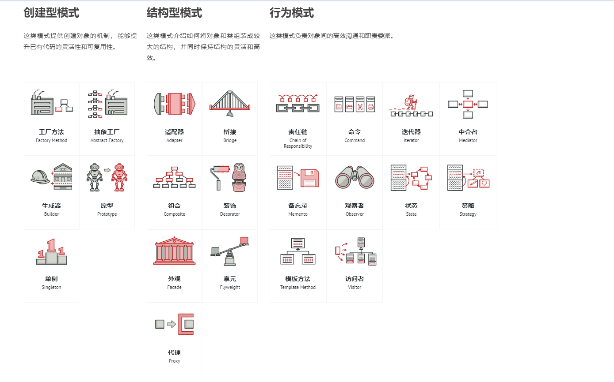
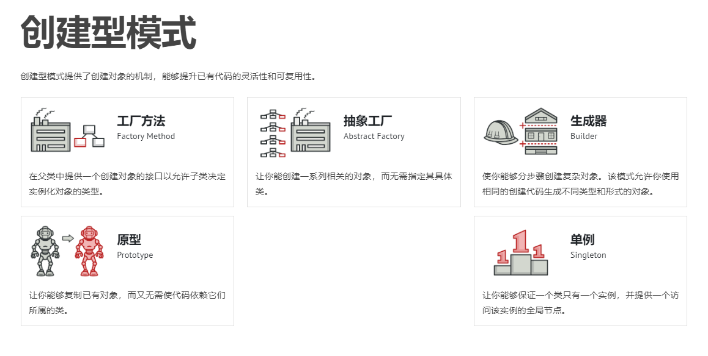
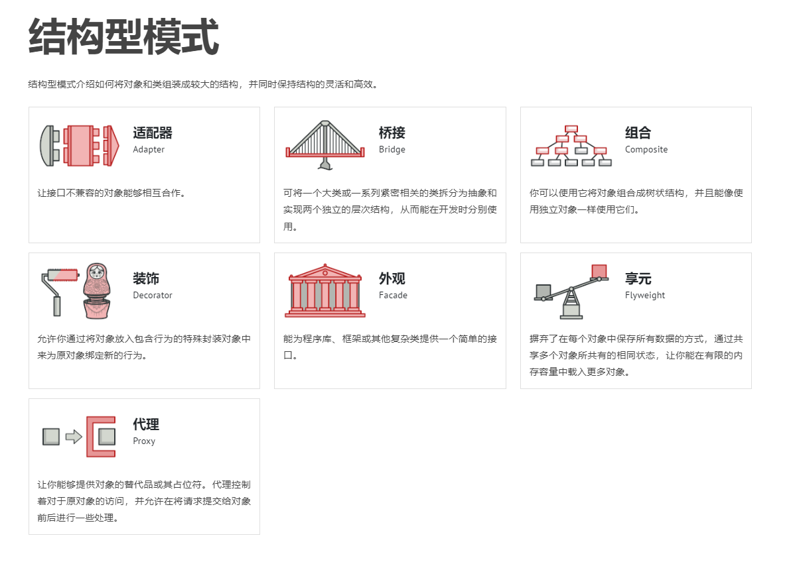
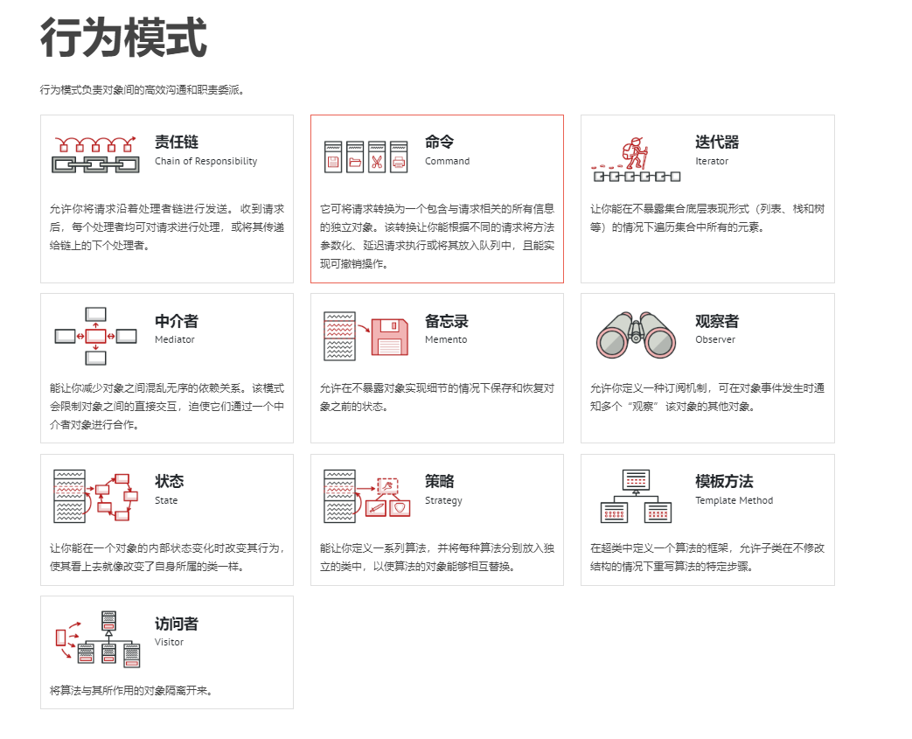

## 总览

图片来自：<a href="https://refactoringguru.cn/design-patterns/catalog">https://refactoringguru.cn/design-patterns/catalog</a>

## 创建型模式

图片来自：<a href="https://refactoringguru.cn/design-patterns/creational-patterns">https://refactoringguru.cn/design-patterns/creational-patterns</a>

- [简单工厂](简单工厂.md)

- [抽象工厂](抽象工厂.md)

- [工厂方法](工厂方法.md)

- [单例模式](单例模式.md)

- [生成器](生成器.md)

## 结构型模式

图片来自：<a href="https://refactoringguru.cn/design-patterns/structural-patterns">https://refactoringguru.cn/design-patterns/structural-patterns</a>

## 行为模式

图片来自：<a href="https://refactoringguru.cn/design-patterns/behavioral-patterns">https://refactoringguru.cn/design-patterns/behavioral-patterns</a>

