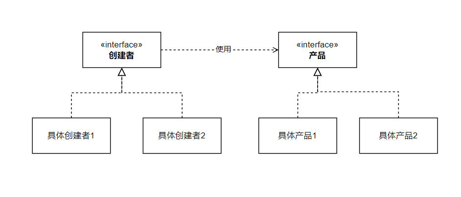

## 概念

在父类中提供一个「创建对象」的方法，允许子类决定实例化对象的类型。

简单理解就是将 `new` 操作放到工厂方法中。


<p style="text-align:center">图片来自：https://refactoringguru.cn/design-patterns/factory-method</p>

- 创建者：声明一个工厂方法，并返回对应类型的产品对象
- 产品：产品接口
- 具体产品：产品接口的不同实现
- 具体创建者：创建者的不同实现，重写工厂方法。

## UML



## 实现

```java
public interface Product {}

public class ConcreteProduct1 implements Product{}

public class ConcreteProduct2 implements Product{}
```

```java
public abstract  IFactory {
    public abstract Product factoryMethod();
}

public ConcreteFactory1 implements IFactory {
    public Product factoryMethod() {
        return new ConcreteProduct1();
    }
}

public ConcreteFactory2 implements IFactory {
    public Product factoryMethod() {
        return new ConcreteProduct2();
    }
}
```


