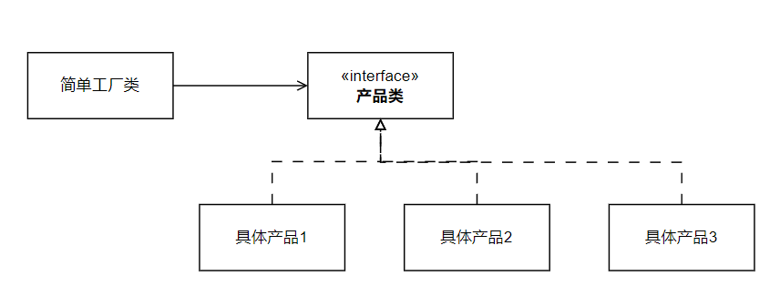

## 概念

使用一个「单独的类」来实现具体的实例化过程，这个类就是一个「简单工厂类」，它可以决定应用什么子类来实例化。

- 客户端不需要知道有哪些子类，或者实例化什么子类

## UML



## 实现

```java
public interface Product {
}

public class Product1 implements Product {
}

public class Product2 implements Product {
}

public class Product3 implements Product {
}
```

```java
public class SimpleFactory {
	
    public Product createProduct(int type) {
    	//.. 根据 type 返回对应的产品    
    }

}
```

