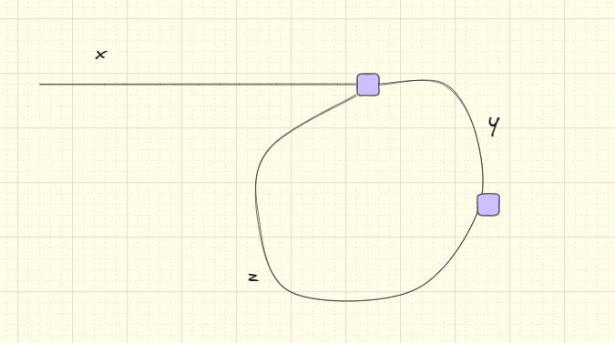

## 题目地址(142. 环形链表 II - 力扣（LeetCode）)

https://leetcode.cn/problems/linked-list-cycle-ii/description/

## 题目描述

<p> 给定一个链表的头节点 &nbsp; <code> head </code>&nbsp;，返回链表开始入环的第一个节点。&nbsp; <em> 如果链表无环，则返回&nbsp; <code> null </code>。</em> </p>

<p> 如果链表中有某个节点，可以通过连续跟踪 <code> next </code> 指针再次到达，则链表中存在环。 为了表示给定链表中的环，评测系统内部使用整数 <code> pos </code> 来表示链表尾连接到链表中的位置（<strong> 索引从 0 开始 </strong>）。如果 <code> pos </code> 是 <code>-1 </code>，则在该链表中没有环。<strong> 注意：<code> pos </code> 不作为参数进行传递 </strong>，仅仅是为了标识链表的实际情况。</p>

<p> <strong> 不允许修改 </strong> 链表。</p>

<ul>
</ul>

<p>&nbsp; </p>

<p> <strong> 示例 1：</strong> </p>

<p>  </p>

<pre> <strong> 输入：</strong> head = [3,2,0,-4], pos = 1
<strong> 输出：</strong> 返回索引为 1 的链表节点
<strong> 解释：</strong> 链表中有一个环，其尾部连接到第二个节点。
</pre>

<p> <strong> 示例&nbsp; 2：</strong> </p>

<p>  </p>

<pre> <strong> 输入：</strong> head = [1,2], pos = 0
<strong> 输出：</strong> 返回索引为 0 的链表节点
<strong> 解释：</strong> 链表中有一个环，其尾部连接到第一个节点。
</pre>

<p> <strong> 示例 3：</strong> </p>

<p>  </p>

<pre> <strong> 输入：</strong> head = [1], pos = -1
<strong> 输出：</strong> 返回 null
<strong> 解释：</strong> 链表中没有环。
</pre>

<p>&nbsp; </p>

<p> <strong> 提示：</strong> </p>

<ul>
	<li> 链表中节点的数目范围在范围 <code> [0, 10 <sup> 4 </sup>] </code> 内 </li>
	<li> <code>-10 <sup> 5 </sup> &lt;= Node.val &lt;= 10 <sup> 5 </sup> </code> </li>
	<li> <code> pos </code> 的值为 <code>-1 </code> 或者链表中的一个有效索引 </li>
</ul>

<p>&nbsp; </p>

<p> <strong> 进阶：</strong> 你是否可以使用 <code> O(1)</code> 空间解决此题？</p>


## 前置知识

- 链表
- 环形证明

## 思路

使用双指针，分别定义为 fast 和 slow。从头节点出发，fast 每次走两步，slow 每次走 1 步。

- 如果存在环，由于 fast 的步速大于 slow，最终 fast 和 slow 一定会在环中相遇
- 如果不存在环，fast 会先于 slow 走到 null

从头节点到环形入口节点的节点数为 x，环形入口节点到 fast 指针与 slow 指针相遇节点节点数为 y。从相遇节点 再到环形入口节点节点数为 z。



相遇时，slow 走过的节点数为 x+y，fast 走过的节点数为 x+y+n(y+z)，其中 n 为走过的环的圈数。

fast 每次走两步，slow 每次走一步。

- x+y+n(y+z) = 2*(x+y) => x = (n-1)(y+z)+z

从「相遇点到入环点的距离」加上「 n−1 圈的环长度」，恰好等于「从链表头部到入环点的距离」。

## 关键点

-  判断链表是否环
-  如果有环，如何找到这个环的入口

## 代码

- 语言支持：Java

Java Code:

```java

/**
 * Definition for singly-linked list.
 * class ListNode {
 *     int val;
 *     ListNode next;
 *     ListNode(int x) {
 *         val = x;
 *         next = null;
 *     }
 * }
 */
public class Solution {
    public ListNode detectCycle(ListNode head) {
        if(head == null || head.next == null){
            return null;
        }
        // 采用双指针的方式
        ListNode fast = head,slow = head;
        // 第一次相遇, fast 走了 2n 个环， slow 走了 n 个环
        while(true){
            if(fast == null || fast.next == null) return null;
            fast = fast.next.next;
            slow = slow.next;
            if(fast == slow) break;
        }
        // 让 fast 和 slow 一起同时 1，在次相遇就是环入口
        fast = head;
        while(fast != slow){
            fast = fast.next;
            slow = slow.next;
        }
        return slow;
    }
}

```

**复杂度分析**

- 时间复杂度：$O(n)$：第一次相遇时，slow 要走 x+y 步，第二次相遇，slow 要走 z 步，总体是线性复杂度
- 空间复杂度：$O(1)$：双指针使用常数大小的额外空间
