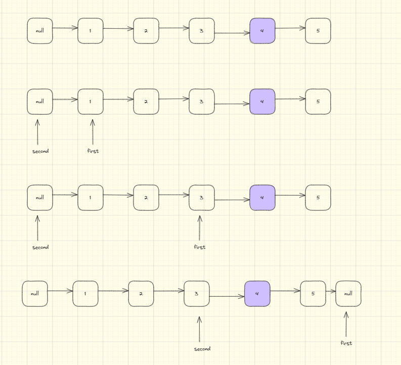

## 题目地址(19. 删除链表的倒数第 N 个结点 - 力扣（LeetCode）)

https://leetcode.cn/problems/remove-nth-node-from-end-of-list/description/

## 题目描述

<p> 给你一个链表，删除链表的倒数第&nbsp; <code> n </code> <em>&nbsp; </em> 个结点，并且返回链表的头结点。</p>

<p>&nbsp; </p>

<p> <strong> 示例 1：</strong> </p>


<pre> <strong> 输入：</strong> head = [1,2,3,4,5], n = 2
<strong> 输出：</strong> [1,2,3,5]
</pre>

<p> <strong> 示例 2：</strong> </p>

<pre> <strong> 输入：</strong> head = [1], n = 1
<strong> 输出：</strong> []
</pre>

<p> <strong> 示例 3：</strong> </p>

<pre> <strong> 输入：</strong> head = [1,2], n = 1
<strong> 输出：</strong> [1]
</pre>

<p>&nbsp; </p>

<p> <strong> 提示：</strong> </p>

<ul>
	<li> 链表中结点的数目为 <code> sz </code> </li>
	<li> <code> 1 &lt;= sz &lt;= 30 </code> </li>
	<li> <code> 0 &lt;= Node.val &lt;= 100 </code> </li>
	<li> <code> 1 &lt;= n &lt;= sz </code> </li>
</ul>

<p>&nbsp; </p>

<p> <strong> 进阶：</strong> 你能尝试使用一趟扫描实现吗？</p>


## 前置知识

- 链表
- 双指针

## 思路 1：双指针

$dummyHead$ 存储虚拟头节点，$first$ 存储头节点，$second$ 存储虚拟头节点，进行遍历。

- 让 $first$ 先走 N 步。
- $second$ 和 $first$ 一起走。
- 当 $first$ 走到空节点时时，$second$ 刚好走好倒数第 N+1 个



## 关键点

-  由于要进行删除操作，因此要找到「倒数第 n+1」个节点位置

## 代码

- 语言支持：Java

Java Code:

```java

/**
 * Definition for singly-linked list.
 * public class ListNode {
 * int val;
 * ListNode next;
 * ListNode() {}
 * ListNode(int val) { this.val = val; }
 * ListNode(int val, ListNode next) { this.val = val; this.next = next; }
 * }
 */
class Solution {
    public ListNode removeNthFromEnd(ListNode head, int n) {
        if (head.next == null && n == 1) {
            return null;
        }
        // 怎么知道是倒数第 2 个，使用双指针，让一个指针先走 2 步
        ListNode dummyHead = new ListNode(-1, head);
        ListNode first = head;
        ListNode second = dummyHead;
        // 让 first 先走 n，让 first 到达尾节点，second 刚好指向倒数第 n 个
        for (int i = 0; i < n; i++) {
            first = first.next;
        }
        while (first != null) {
            first = first.next;
            second = second.next;
        }
        second.next = second.next.next;
        return dummyHead.next;
    }
}

```


**复杂度分析**

令 n 为数组长度。

- 时间复杂度：$O(n)$
- 空间复杂度：$O(1)$
