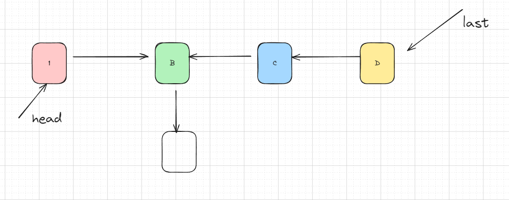
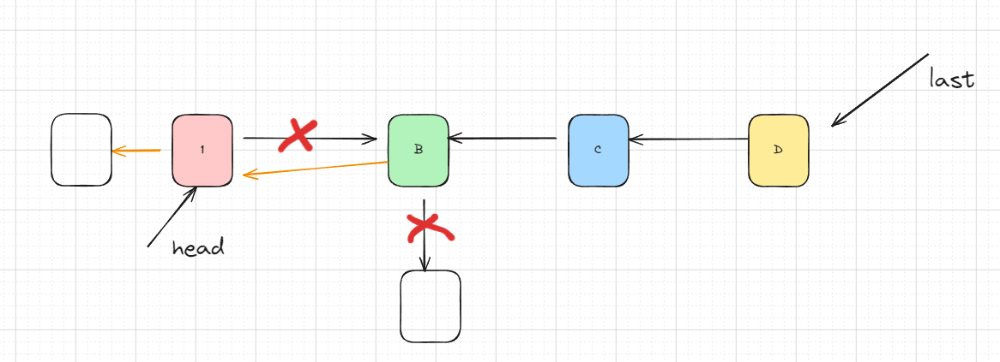

## 题目地址(206. 反转链表 - 力扣（LeetCode）)

https://leetcode.cn/problems/reverse-linked-list/

## 题目描述

给你单链表的头节点 <code>head</code> ，请你反转链表，并返回反转后的链表。
<div class="original__bRMd">
<div>
<p>&nbsp;</p>

<p><strong>示例 1：</strong></p>


<pre><strong>输入：</strong>head = [1,2,3,4,5]
<strong>输出：</strong>[5,4,3,2,1]
</pre>

<p><strong>示例 2：</strong></p>


<pre><strong>输入：</strong>head = [1,2]
<strong>输出：</strong>[2,1]
</pre>

<p><strong>示例 3：</strong></p>

<pre><strong>输入：</strong>head = []
<strong>输出：</strong>[]
</pre>

<p>&nbsp;</p>

<p><strong>提示：</strong></p>

<ul>
	<li>链表中节点的数目范围是 <code>[0, 5000]</code></li>
	<li><code>-5000 &lt;= Node.val &lt;= 5000</code></li>
</ul>

<p>&nbsp;</p>

<p><strong>进阶：</strong>链表可以选用迭代或递归方式完成反转。你能否用两种方法解决这道题？</p>
</div>
</div>


## 前置知识

- 链表
- 双指针/递归思想

## 思路1:双指针


<p style="text-align:center">图片来自：<a href="https://programmercarl.com/0206.%E7%BF%BB%E8%BD%AC%E9%93%BE%E8%A1%A8.html#%E6%80%9D%E8%B7%AF">代码随想录</a> </p>

- $pre$ 指向虚拟节点，$cur$ 指向头节点
- 在每一次移动过程中，修改节点指向

### 关键点

先存储 next 引用 $next = cur.next$

-  $cur.next = pre$
-  $pre = cur$
-  $cur = next$

### 代码

- 语言支持：Java

Java Code:

```java

/**
 * Definition for singly-linked list.
 * public class ListNode {
 * int val;
 * ListNode next;
 * ListNode() {}
 * ListNode(int val) { this.val = val; }
 * ListNode(int val, ListNode next) { this.val = val; this.next = next; }
 * }
 */
class Solution {
    public ListNode reverseList(ListNode head) {
        ListNode prev = null; // 前驱节点 null
        ListNode curr = head; // 当前节点 1 (1->2)
        while (curr != null) {
            ListNode next = curr.next; // 后驱节点 2
            curr.next = prev; // 反向 1<-2
            prev = curr;  // prev = 1
            curr = next; // curr = 2
        }
        return prev;
    }
}

```

**复杂度分析**

令 n 为链表长度。

- 时间复杂度：$O(n)$
- 空间复杂度：$O(1)$


## 思路2：递归

递归函数的定义

- 输出一个节点 head
- 将 head 为起点的链表进行反转
- 返回反转之后的头节点

### 关键点

理解递归

当第一次递归时，已经把链表分成后两部分





### 代码

```java
class Solution {
    public ListNode reverseList(ListNode head) {
        if (head == null || head.next == null) {
            return head;
        }
        ListNode last = reverseList(head.next);
        head.next.next = head;
        head.next = null;
        return last;
    }
}
```

**复杂度分析**

令 n 为链表长度。

- 时间复杂度：$O(n)$
- 空间复杂度：$O(n)$，空间复杂度主要取决于递归调用的栈空间，最多为 $n$ 层。
