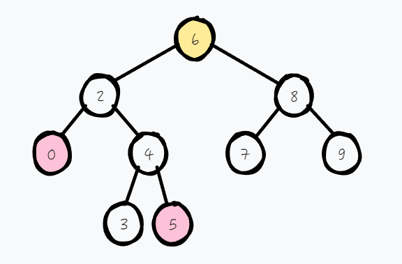
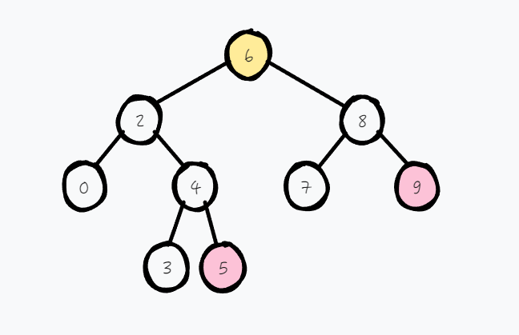

## 题目地址(235. 二叉搜索树的最近公共祖先 - 力扣（LeetCode）)

https://leetcode.cn/problems/lowest-common-ancestor-of-a-binary-search-tree/description/

## 题目描述

<p>给定一个二叉搜索树, 找到该树中两个指定节点的最近公共祖先。</p>

<p><a href="https://baike.baidu.com/item/%E6%9C%80%E8%BF%91%E5%85%AC%E5%85%B1%E7%A5%96%E5%85%88/8918834?fr=aladdin" target="_blank">百度百科</a>中最近公共祖先的定义为：“对于有根树 T 的两个结点 p、q，最近公共祖先表示为一个结点 x，满足 x 是 p、q 的祖先且 x 的深度尽可能大（<strong>一个节点也可以是它自己的祖先</strong>）。”</p>

<p>例如，给定如下二叉搜索树:&nbsp; root =&nbsp;[6,2,8,0,4,7,9,null,null,3,5]</p>

<p></p>

<p>&nbsp;</p>

<p><strong>示例 1:</strong></p>

<pre><strong>输入:</strong> root = [6,2,8,0,4,7,9,null,null,3,5], p = 2, q = 8
<strong>输出:</strong> 6 
<strong>解释: </strong>节点 <code>2 </code>和节点 <code>8 </code>的最近公共祖先是 <code>6。</code>
</pre>

<p><strong>示例 2:</strong></p>

<pre><strong>输入:</strong> root = [6,2,8,0,4,7,9,null,null,3,5], p = 2, q = 4
<strong>输出:</strong> 2
<strong>解释: </strong>节点 <code>2</code> 和节点 <code>4</code> 的最近公共祖先是 <code>2</code>, 因为根据定义最近公共祖先节点可以为节点本身。</pre>

<p>&nbsp;</p>

<p><strong>说明:</strong></p>

<ul>
	<li>所有节点的值都是唯一的。</li>
	<li>p、q 为不同节点且均存在于给定的二叉搜索树中。</li>
</ul>


## 思路

与这道题 [235-二叉搜索树的最近公共祖先](./235-二叉搜索树的最近公共祖先.md) 类似，不过本题多了一个特点，是二叉搜索树。

- 如果 p 和 q 都**小于** root 节点时，就说明它们是在root的**左子树**，需要往**左子树**继续寻找最近公共祖先
- 如果 p 和 q 都**大于** root 节点时，就说明它们是在root的**右子树**，需要往**右子树**继续寻找最近公共祖先
- 如果 p/q 大于 root 节点，q/p 小于 root 节点，说明它们一个是在左子树，一个在右子树，那么 root 就是它们的最近公共祖先







## 关键点

-  祖先的定义
-  最近公共祖先的定义
-  二叉搜索树的特性

## 代码

```java

/**
 * Definition for a binary tree node.
 * public class TreeNode {
 * int val;
 * TreeNode left;
 * TreeNode right;
 * TreeNode(int x) { val = x; }
 * }
 */

class Solution {
    public TreeNode lowestCommonAncestor(TreeNode root, TreeNode p, TreeNode q) {
        if (root.val > p.val && root.val > q.val)
            return lowestCommonAncestor(root.left, p, q);
        if (root.val < p.val && root.val < q.val)
            return lowestCommonAncestor(root.right, p, q);
        return root;
    }
}

```


**复杂度分析**

令 n 为二叉树节点个数。

- 时间复杂度：$O(n)$，遍历的情况跟 p 和 q在树中的深度线性相关，最想情况下，是成一条链，其中一个是叶子节点，一个是父节点。
- 空间复杂度：$O(n)$，最坏情况下，变成一条链，需要的栈深度为O(n)

