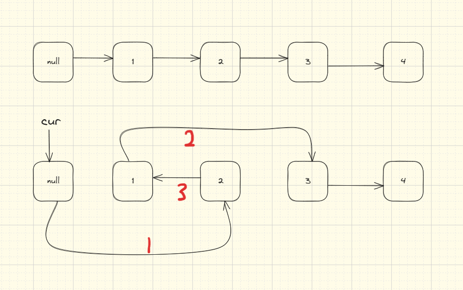

## 题目地址(24. 两两交换链表中的节点 - 力扣（LeetCode）)

https://leetcode.cn/problems/swap-nodes-in-pairs/description/

## 题目描述

<p>给你一个链表，两两交换其中相邻的节点，并返回交换后链表的头节点。你必须在不修改节点内部的值的情况下完成本题（即，只能进行节点交换）。</p>

<p>&nbsp;</p>

<p><strong>示例 1：</strong></p>

<pre><strong>输入：</strong>head = [1,2,3,4]
<strong>输出：</strong>[2,1,4,3]
</pre>

<p><strong>示例 2：</strong></p>

<pre><strong>输入：</strong>head = []
<strong>输出：</strong>[]
</pre>

<p><strong>示例 3：</strong></p>

<pre><strong>输入：</strong>head = [1]
<strong>输出：</strong>[1]
</pre>

<p>&nbsp;</p>

<p><strong>提示：</strong></p>

<ul>
	<li>链表中节点的数目在范围 <code>[0, 100]</code> 内</li>
	<li><code>0 &lt;= Node.val &lt;= 100</code></li>
</ul>


## 前置知识

- 链表

## 思路1：虚拟头节点

使用变量 $cur$ 代表当前节点，初始化为 $cur = dummy$

使用两个变量 $first$ 和 $second$ 待交换的节点，即 $first = cur.next$ 和 $second = cur.next.next$

当链表还剩下两个节点时，就可以进行更改链表节点的交换

- cur.next = secod
- first.next = second.next
- second.next = first
- cur = first

进行下一轮的判断并且交换



## 关键点

1. 循环条件是当前链表还有2个以上的节点
2. 链表节点交换的指针变动

## 代码

- 语言支持：Java

Java Code:

```java

/**
 * Definition for singly-linked list.
 * public class ListNode {
 *     int val;
 *     ListNode next;
 *     ListNode() {}
 *     ListNode(int val) { this.val = val; }
 *     ListNode(int val, ListNode next) { this.val = val; this.next = next; }
 * }
 */
class Solution {
    public ListNode swapPairs(ListNode head) {
        if (head == null || head.next == null) {
            return head;
        }
        ListNode dummy = new ListNode(0); // 设置一个虚拟头节点
        dummy.next = head; // 将虚拟头结点指向head,这样方便后续做删除操作
        ListNode cur = dummy;
        while (cur.next != null && cur.next.next != null) {
            ListNode first = cur.next;
            ListNode second = cur.next.next;
            cur.next = second; // 步骤一
            first.next = second.next; // 步骤三
            second.next = first; // 步骤二
            cur = first;
        }
        return dummy.next;
    }
}

```


**复杂度分析**

令 n 为链表长度。

- 时间复杂度：$O(n)$
- 空间复杂度：$O(1)$
