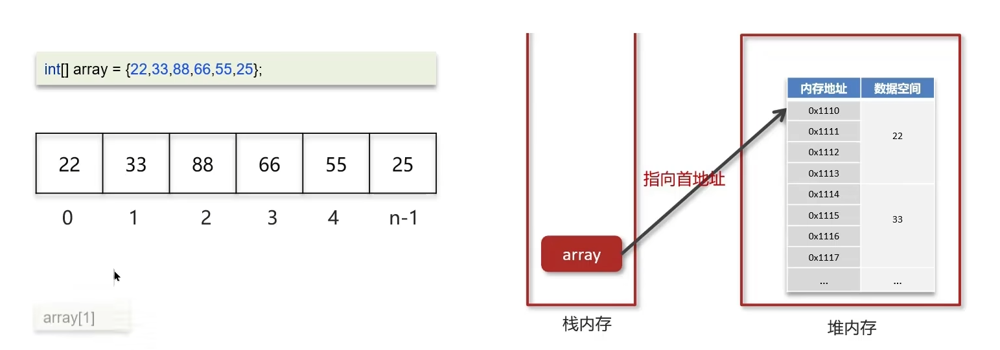
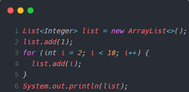
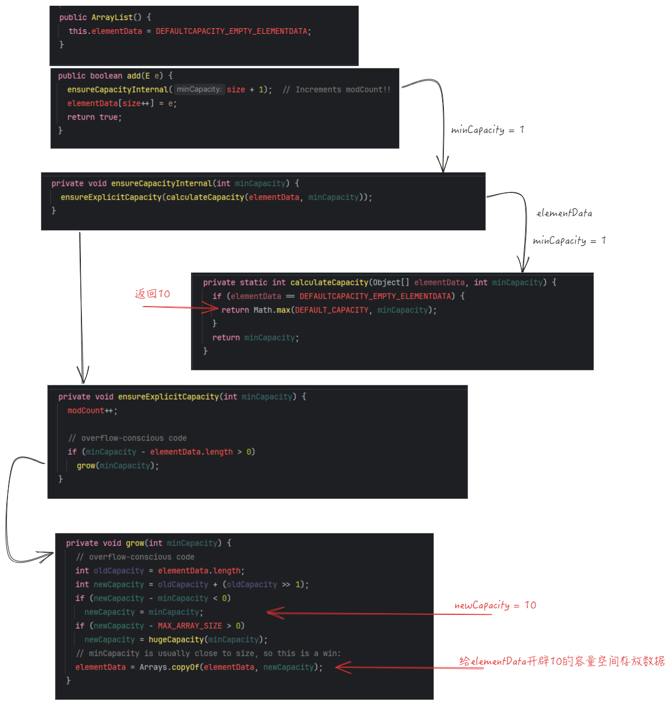

## 数组

连续的内存空间

存储相同的数据类型数据

线性



通过寻址公式，达到快速访问的目的 $a[i] = baseAddr +i* dataTypeSize$

- baseAddr: 数组首地址
- dataTypeSize: 数据类型的大小


>  为什么数组索引从 0 开始？为什么不是从 1 开始？

这是一种计算的便利，只不是把上面的 $i$ 变成 $i-1$


## 操作时间复杂度

n 为数组的元素个数

查找：O(1)

插入、删除：最好情况下是 O(1), 最坏情况下是 O(n)，平均下来时间复杂度为 O(n)


## 源码分析

### 成员变量

```java
    /**
     * 默认初始容量
     */
    private static final int DEFAULT_CAPACITY = 10;

    /**
     * 用于空实例的共享空数组实例
     */
    private static final Object[] EMPTY_ELEMENTDATA = {};

    /**
     * 用于默认大小的空实例的共享空数组实例。我们将其与 EMPTY_ELEMENTDATA 区分开来，以便知道添加第一个元素时要膨胀多少。
     */
    private static final Object[] DEFAULTCAPACITY_EMPTY_ELEMENTDATA = {};

    /**
     * 存储 ArrayList 元素的数组缓冲区。
     * ArrayList 的容量就是这个数组缓冲区的长度。任何带有 elementData == DEFAULTCAPACITY_EMPTY_ELEMENTDATA 的空数组列表将在添加第一个元素时扩展为 DEFAULT_CAPACITY。
     */
    transient Object[] elementData; // non-private to simplify nested class access

    /**
     * 数组列表的大小(包含的元素数量)。
     *
     */
    private int size;
```

### 构造函数

构造函数有三种：根据初始容量，默认方式，根据集合

```java
public ArrayList(int initialCapacity) {}
public ArrayList() {}
public ArrayList(Collection<? extends E> c) {}
```

#### 根据初始容量来创建

```java
public ArrayList(int initialCapacity) {
    if (initialCapacity > 0) {
        this.elementData = new Object[initialCapacity];
    } else if (initialCapacity == 0) {
        this.elementData = EMPTY_ELEMENTDATA;
    } else {
        throw new IllegalArgumentException("Illegal Capacity: "+
                                           initialCapacity);
    }
}
```

根据容量给 `elementData` 赋值。如果 `initialCapacity = 0` ，则 `EMPTY_ELEMENTDATA` 和 `elementData` 一样

#### 无参构造函数

```java
public ArrayList() {
    this.elementData = DEFAULTCAPACITY_EMPTY_ELEMENTDATA;
}
```

由于不需要传初始容量，所以 `elementData` 实际就是一个默认初始容量的空数组实例 `DEFAULTCAPACITY_EMPTY_ELEMENTDATA`。

当往数组添加第一个元素时，`elementData` 就会直接扩容到默认初始容量 `DEFAULT_CAPACITY`

#### 根据集合的构造函数

```java
public ArrayList(Collection<? extends E> c) {
    Object[] a = c.toArray();
    if ((size = a.length) != 0) {
        if (c.getClass() == ArrayList.class) {
            elementData = a;
        } else {
            elementData = Arrays.copyOf(a, size, Object[].class);
        }
    } else {
        // replace with empty array.
        elementData = EMPTY_ELEMENTDATA;
    }
}
```

如果传进来的集合为空，即与 `ArrayList<>(0)` 的方式一致。

如果集合的类型是 `ArrayList` 类型，则直接进行 **赋值**。否则就将集合中元素复制到 `elementData` 中


#### 总结

本质上就是赋值给 `elementData`，或者将元素复制添加到 `elementData` 中。


### 添加操作（第一次扩容）



当执行下面两行代码时

```java
List<Integer> list = new ArrayList<>();
list.add(1);
```

根据上面的构造函数可知，此时有

```java
this.elementData = DEFAULTCAPACITY_EMPTY_ELEMENTDATA;
```

```java
public boolean add(E e) {
    ensureCapacityInternal(size + 1);  // Increments modCount!!
    elementData[size++] = e;
    return true;
}
```

`ensureCapacityInternal()` 函数的作用是确保内部容量大小问题，如果容量不足则需要扩容。

```java
private void ensureCapacityInternal(int minCapacity) {
    ensureExplicitCapacity(calculateCapacity(elementData, minCapacity));
}
```

其实是相当于调用 `calculateCapacity(this.elementData,1)`，因此最终会返回 `DEFAULT_CAPACITY`。

```java
private static int calculateCapacity(Object[] elementData, int minCapacity) {
    if (elementData == DEFAULTCAPACITY_EMPTY_ELEMENTDATA) {
        return Math.max(DEFAULT_CAPACITY, minCapacity);
    }
    return minCapacity;
}
```

经过上一步，实际上是调用 `ensureExplicitCapacity(10)`，所以最终会进入 `grow()` 函数进行国荣

```java
private void ensureExplicitCapacity(int minCapacity) {
    modCount++;

    if (minCapacity - elementData.length > 0)
        grow(minCapacity);
}
```


```java
private void grow(int minCapacity) {

    int oldCapacity = elementData.length; // 0
    int newCapacity = oldCapacity + (oldCapacity >> 1); // 0
    if (newCapacity - minCapacity < 0)
        newCapacity = minCapacity; // 10
    if (newCapacity - MAX_ARRAY_SIZE > 0)
        newCapacity = hugeCapacity(minCapacity);
    // minCapacity is usually close to size, so this is a win:
    elementData = Arrays.copyOf(elementData, newCapacity);
}
```

综上所述，在调用 `ensureCapacityInternal(size+1)` 后 相当于调用 `ensureCapacityInternal(1)`。最终是使 `elementData` 数组容量缓冲区的容量扩容为 `DEFAULT_CAPACITY` ，也就是 10。

最后在将元素放进数组中。



### 添加操作（第二次扩容）

当调用 `add(E e)` 时，会调用 `ensureCapacityInternal(size + 1)`, 最终会去调用 `ensureExplicitCapacity(size+1)` 而触发 `grow()` 操作

```java
private void ensureExplicitCapacity(int minCapacity) {
    modCount++;

    // overflow-conscious code
    if (minCapacity - elementData.length > 0)
        grow(minCapacity);
}
```

当 `minCapacity = 11` , `elementData.length = 10` 时，会发生第二次 `grow()`

```java
private void grow(int minCapacity) {
    // overflow-conscious code
    int oldCapacity = elementData.length;
    int newCapacity = oldCapacity + (oldCapacity >> 1); // 原来的 1.5 倍
    if (newCapacity - minCapacity < 0)
        newCapacity = minCapacity; // 第一次扩容的数组长度
    if (newCapacity - MAX_ARRAY_SIZE > 0)
        newCapacity = hugeCapacity(minCapacity);
    // minCapacity is usually close to size, so this is a win:
    elementData = Arrays.copyOf(elementData, newCapacity);
}
```

此时根据代码，会发现 `newCapacity` 是 `oldCapacity` 的 1.5 倍，即 `elementData` 的容量变成原来的 1.5 倍


## 总结

> ArrayList 的实现原理是什么

ArrayList 底层是用动态数组实现

初始容量为 0，当第一次添加容量时，才会初始化容量为 10

在进行扩容的时候，容量为原来的 1.5 倍，每次扩容都需要拷贝数组

在添加数据的时候

- 确保数组长度已使用长度(size)+1 之后足够存放下一个数据
- 计算数组的容量，如果当前数组已使用长度+1 > 当前数组长度，就会发生扩容
- 新增的数据位置是 size
- 添加成功返回 true


> 数组转换为 List，以及 List 转换为数组

```java
String[] array = {"a", "b", "c"};
List<String> list = Arrays.asList(array);
```

```java
String[] array = {"a", "b", "c"};
List<String> list = new ArrayList<>();
Collections.addAll(list, array);
```

```java
String[] array = {"a", "b", "c"};
List<String> list = Arrays.stream(array).collect(Collectors.toList());
```


```java
List<String> list = new ArrayList<>();
list.add("a");
list.add("b");
list.add("c");
Object[] array = list.toArray();
```

```java
List<String> list = new ArrayList<>();
list.add("a");
list.add("b");
list.add("c");
String[] array = Arrays.copyOf(list.toArray(), list.size(), String[].class);
```

```java
List<String> list = new ArrayList<>();
list.add("a");
list.add("b");
list.add("c");
String[] array = list.stream().toArray(String[]::new);
```

> 使用 Arrays.asList 转换为 List 后，如果修改了数组内容，list 受影响嘛？

```java
String[] array = {"a", "b", "c"};
List<String> list = Arrays.asList(array);
```

array 数组被包装成 `java.util.Arrays.ArrayList` 内部类，当数组内容发生改变时，list会受到影响。


> List 用 toArray 转数组后，如果修改了 List 内容，数组会受影响嘛？

在底层里，进行了数组的拷贝，影响的只是内部的数组，跟外面的数组没有关系。
