> 文章内容来自：
>
> - [浅谈缓存最终一致性的解决方案](https://mp.weixin.qq.com/s?__biz=MjM5ODYwMjI2MA==&mid=2649766984&idx=1&sn=fb6dcafedc845584049c56ba6fedc13c&scene=21#wechat_redirect)
>
> - [浅谈缓存一致性](https://mp.weixin.qq.com/s/VprIIqJ4wdqMiXY8LRXAJA)

## 引入

持久化层和缓存层的一致性问题也通常被称为双写一致性问题。对于一致性来说，有强一致性和弱一致性。

- 强一致性保证写入后立即可以读取。
- 弱一致性则不保证立即可以读取写入后的值，而是尽可能的保证在**经过一定时间后**可以读取到。

在弱一致性中应用最为广泛的模型则是「最终一致性模型」，即保证在一定时间之后写入和读取达到一致的状态。

## 旁路缓存模式（Cache-Aside）

**Cache-Aside 旁路缓存模式**，是应用最为广泛的一种缓存策略。

- **在读请求中**，首先请求缓存，若缓存命中（cache hit），则直接返回缓存中的数据；若缓存未命中（cache miss），则查询数据库并将查询结果更新至缓存，然后返回查询出的数据（demand-filled look-aside）。

- **在写请求中**，先更新数据库，再删除缓存（write-invalidate）。

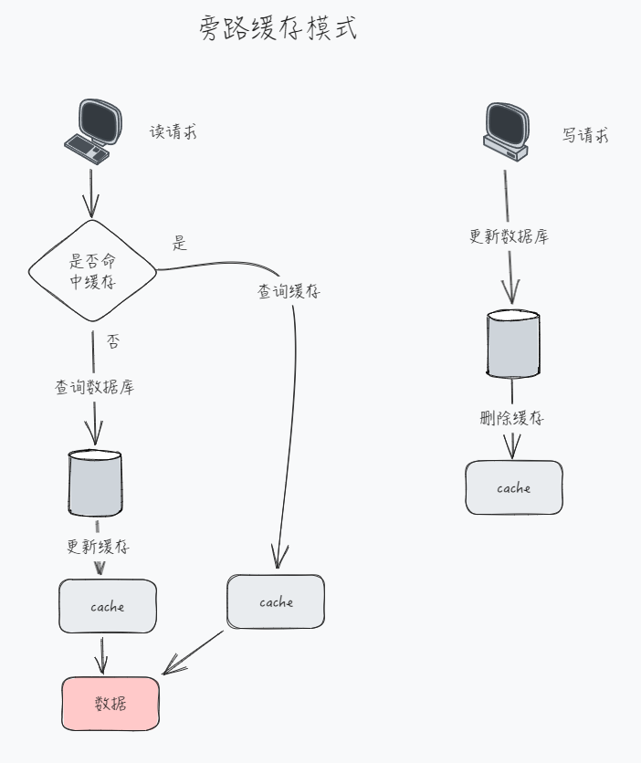

### 为什么删除缓存，而不是更新缓存

- 在写操作中，当该缓存对应的结果需要消耗大量的计算过程才能得到时，更新缓存会是一笔不小的开销。
- 当写操作较多时，可能也会存在**刚更新的缓存还没有被读取到，又再次被更新**的情况。
- 删除缓存的操作不仅是幂等的，可以在发生异常时重试，而且**写-删除**和**读-更新**在语义上更加对称。

在并发场景下，**在写请求中更新缓存可能会引发数据的不一致问题**：有两个线程去更新同一个数值，线程 A 把数据更新为 1，线程 B 把数据更新为 2，我们期望的结果是以下两种情况之一：

1. 「数据库」里的数据是 1 且「缓存」里的数据也是 1；
2. 「数据库」里的数据是 2 且「缓存」里的数据也是 2；

模拟并发写场景：

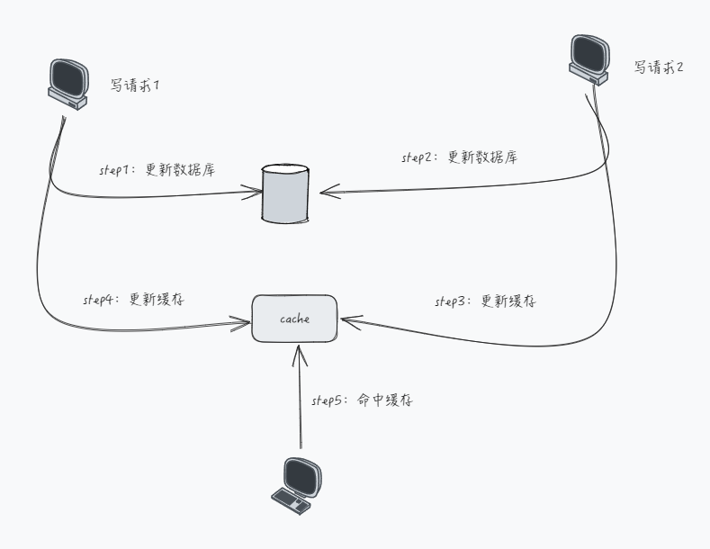

| **时刻** | **线程A（写）** | **线程B（写）** |
|----------|-----------------|-----------------|
| **T1**   | 更新数据库为 1  |                 |
| **T2**   |                 | 更数据库为 2    |
| **T3**   |                 | 更新缓存为 2    |
| **T4**   | 更新缓存为 1    |                 |

**这个时候如果有 读请求 命中缓存，读取的便是旧值**

### 为什么先更新数据库，而不是先删除缓存？

在单线程下，在删除缓存成功，但更新数据库失败的场景下。尽管缓存被删除了，下次读操作时，仍能将正确的数据写回缓存。这种方式看起来有一定的合理性。相对于 Cache-Aside 中更新数据库成功，删除缓存失败的场景来说，先删除缓存的方案似乎更合理一些。

在并发读写的场景下仍然存在不一致的问题：

考虑这样的场景：目前 a 在缓存和数据库的值都为 **1，现在有线程 A 去将 a 修改为 2，同时有线程 B 去读取 a**，我们期望的结果是以下两种情况之一：

1. a 在「缓存」中失效且 a 在「数据库」中的值是 2；

2. a 在「缓存」中的值是 2 且 a 在「数据库」中的值是 2。

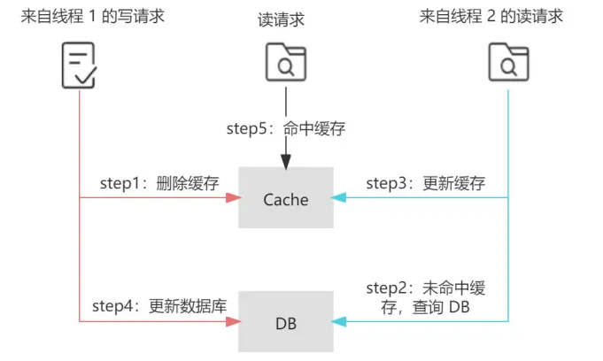

| **时刻** | **线程A（写）**       | **线程B（读）**                                    |
|----------|-----------------------|----------------------------------------------------|
| **T1**   | 删除缓存 a            |                                                    |
| **T2**   |                       | 先读缓存，发现缓存未命中；从数据库中读取 a 的值为1 |
| **T3**   |                       | 更新 a 缓存为 1                                    |
| **T4**   | 更新数据库 a 的值为 2 |                                                    |

这个时候 读请求 读取到的是旧值（即缓存落后于数据库）

### 延迟双删

为了避免“先删除缓存，再更新数据库”这一方案在读写并发时可能带来的缓存脏数据。业界提出了 **延迟双删** 的策略。

> 延迟双删：**在更新数据库之后，延迟一段时间再次删除缓存。为了保证第二次删除缓存的时间点在 读请求 更新缓存之后，这个延迟时间的经验值通常应稍大于业务中读请求的耗时。**

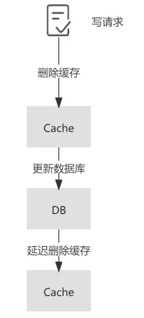

### Cache-Aside 也存在数据不一致

**目前 a 数据库的值为 1 且在缓存中失效，现在有线程 A 去将 a 修改为 2，同时有线程 B 去读取 a**，我们期望的结果是以下两种情况之一：

1. a 在「缓存」中失效且 a 在「数据库」中的值是 2；

2. a 在「缓存」中的值是 2 且 a 在「数据库」中的值是 2。

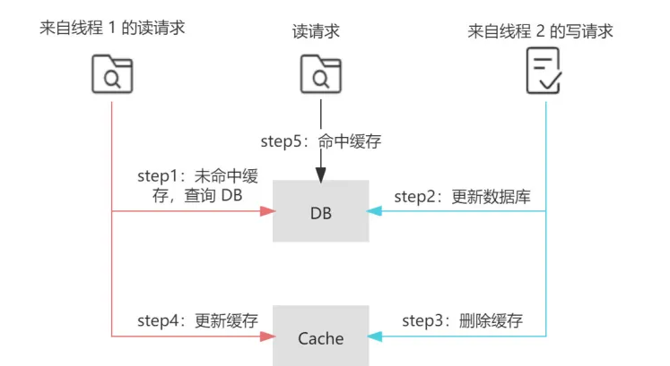

| **时刻** | **线程A（写）**       | **线程B（读）**                                   |
|----------|-----------------------|---------------------------------------------------|
| **T1**   |                       | 先读缓存，发现缓存失效；从数据库中读取 a 的值为 1 |
| **T2**   | 更新数据库 a 的值为 2 |                                                   |
| **T3**   | 删除缓存 a            |                                                   |
| **T4**   |                       | 更新 a 缓存为 1                                   |

这种场景的出现，

- **需要缓存失效**且**读写并发执行**
- 读请求查询数据库的执行 早于 写请求更新数据库，同时读请求的执行完成 晚于 写请求。

读请求命中缓存的时间点在写请求更新数据库之后，删除缓存之前的情况如下：

| **时刻** | **线程A（写）**       | **线程B（读）**             |
|----------|-----------------------|-----------------------------|
| **T1**   | 更新数据库 a 的值为 2 |                             |
| **T2**   |                       | 先读缓存，缓存命中，缓存为1 |
| **T3**   | 删除缓存 a            |                             |

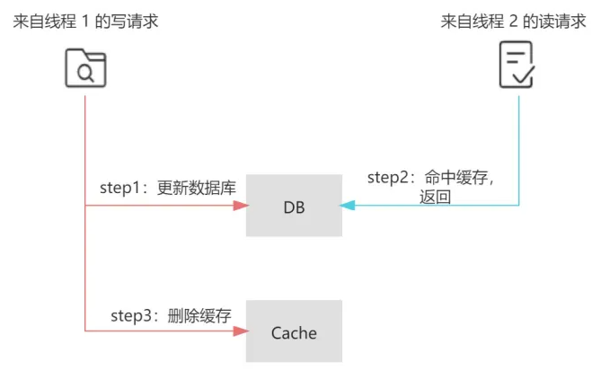

业务层面对这种情况的容忍度较低，那么可以采用加锁在写请求中保证**【更新数据库&删除缓存】**的串行执行为原子性操作，同理也可对读请求中**【缓存更新】**加锁

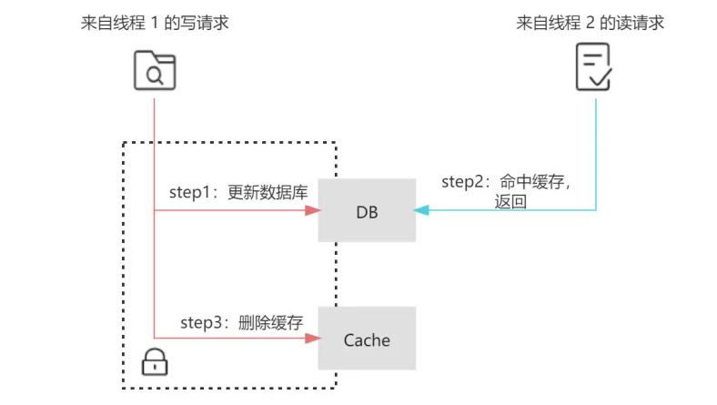

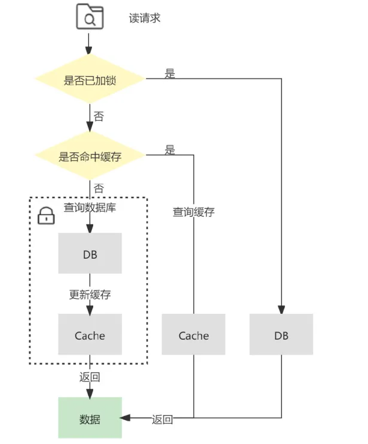

### 补偿机制

在 Cache-Aside 中可能存在更新数据库成功，但删除缓存失败的场景，如果这种情况发生，那么便会导致缓存中的数据落后于数据库，产生数据的不一致的问题。

#### 删除重试机制

通过引入消息队列，将删除失败的缓存对应的 `key` 放入消息队列中，在对应的消费者中获取删除失败的 `key`，异步重试删除。

这种方法在实现上相对简单，但由于删除失败后的逻辑需要基于业务代码的 trigger 来触发 ，对业务代码具有一定入侵性。

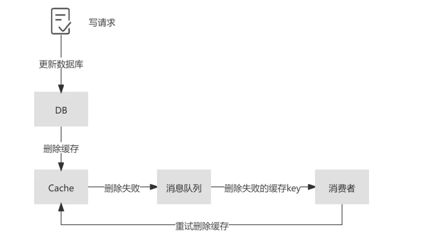

#### Read-Through（读穿透模式）

 Read-Through 中多了一个访问控制层，**读请求只和该访问控制层进行交互**，而背后缓存命中与否的逻辑则由访问控制层与数据源进行交互，业务层的实现会更加简洁，并且对于缓存层及持久化层交互的封装程度更高，更易于移植。

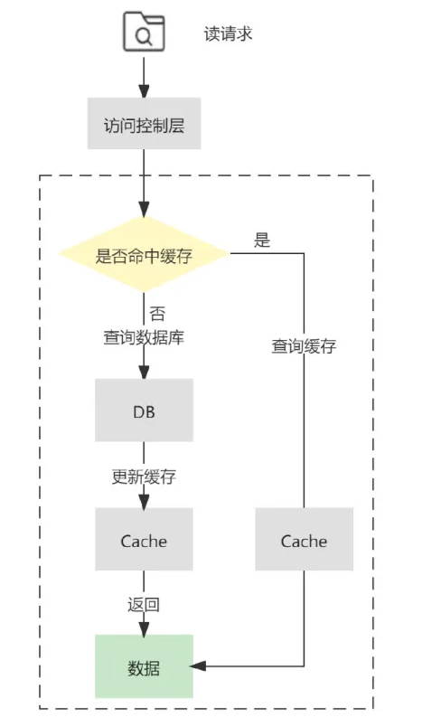

#### Write-Through（直写模式）

它也增加了访问控制层来提供更高程度的封装。不同于 Cache-Aside 的是，**Write-Through 直写模式在写请求更新数据库之后，并不会删除缓存，而是更新缓存**。

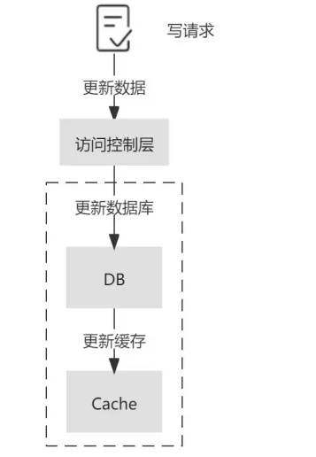

弊端：

- 上面我们提到的更新数据库再更新缓存的弊端
- 更新效率低
- 两个写操作任何一次写失败都会造成数据不一致

解决：

- 将这两个操作作为事务处理，可以同时失败或者同时成功，支持回滚，并且防止并发环境下的不一致。
- 分布式锁解决，保证对缓存和数据库的操作仅能由同一个线程完成。对于没有拿到锁的线程，一是通过锁的 `timeout` 时间进行控制，二是将请求暂存在消息队列中顺序消费。

#### Write-Behind（异步回写模式）

Write behind 在处理写请求时，只更新缓存而不更新数据库。

对于数据库的更新，则是通过批量异步更新的方式进行的，**批量写入的时间点可以选在数据库负载较低的时间进行**。

> 如何判断数据库负载较低？

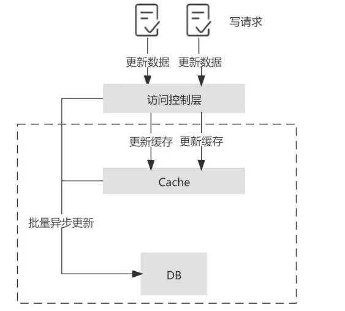

在 Write-Behind 模式下，写请求延迟较低，减轻了数据库的压力，具有较好的吞吐性。

弊端：

- **数据库和缓存的一致性较弱**，比如当更新的数据还未被写入数据库时，直接从数据库中查询数据是落后于缓存的。
- 缓存的负载较大，如果缓存宕机会导致数据丢失，所以需要做好缓存的高可用。

#### Write-Around

如果一些非核心业务，对一致性的要求较弱，可以选择在 cache aside 读模式下增加一个**缓存过期时间**，在写请求中仅仅更新数据库。但缓存中的数据和数据库数据一致性较差，往往会造成用户的体验较差，应慎重选择。

### 总结

读多写少的场景下，可以选择采用**“ Cache-Aside 结合消费数据库日志做补偿”**的方案，

写多的场景下，可以选择采用**“ Write-Through 结合分布式锁”**的方案 ，

写多的极端场景下，可以选择采用**“ Write-Behind ”** 的方案。